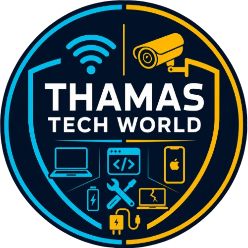

# THAMAS TECH WORLD — Professional WiFi & Networking Portfolio

> **We Do IT Right.** — Professional networking solutions for homes and businesses across South Africa.

---

## 📖 About This Project

This is the official business portfolio website for **THAMAS TECH WORLD**, a South African ICT and networking company established in March 2026. The website showcases our completed projects, technical expertise, and the professional networking solutions we offer.

The site is designed to build trust and demonstrate our capabilities through real project evidence, including case studies, configuration screenshots, speed test reports, and customer reviews.

---

## 🚀 Live Demo

**GitHub Pages URL:**  
 https://dagg12.github.io/Thamas-portfolio/

---

## ✨ Features

### 🏠 Home Section
- Animated hero with typing effect
- Floating network icons (WiFi, router, cloud, signal)
- Glowing network nodes background
- Call-to-action buttons (Quote, WhatsApp, Call)

### 📋 About Us
- Company story and mission
- Core values (Reliability, Innovation, Integrity, Customer Focus)
- Professional branding

### 🛠 Services
- 30+ networking services listed
- Beautiful animated service cards
- Covers: WiFi Installation, Mesh Networks, Router Config, Optimization, and more

### 📁 Completed Projects (Case Studies)
- **22 Formax** – Three-storey residential house
- **21 Sirius** – Two-storey house (Riverbend Garden)
- **29 Regulus** – Single-storey house with outdoor rooms
- Each project includes:
  - Hero image
  - Overview
  - Equipment used
  - Services performed
  - Results (before/after speed comparison)
  - Outcome badges

### 📊 Reports & Technical Documentation
- Coverage Reports
- Speed Test Reports
- Signal & Bandwidth Reports
- Network Health Reports
- Lightbox preview for each report

### 🖼️ Photo Gallery
- Masonry grid layout
- Installation photos
- Configuration screenshots
- Lightbox zoom functionality

### 👥 Team
- Co-founders: Kevin Thamaga & Tebogo Masiteng
- Professional profile photos
- Role and bio information

### ⭐ Customer Reviews
- Real 5-star testimonials from actual clients:
  - Punki (29 Regulus)
  - Petunia (21 Sirius)
  - Nathi Ndwande (22 Formax)
- Phone numbers included for verification

### 📱 Contact
- Phone, WhatsApp, Email
- Business hours
- Social media links
- Quotation request form

---

## 🛠 Technologies Used

- **HTML5** – Semantic markup
- **CSS3** – Custom properties, animations, glassmorphism
- **JavaScript** – Vanilla JS, lightbox, animations
- **Font Awesome** – Professional icons
- **Google Fonts** – Inter typeface
- **AOS** – Animate On Scroll library
- **GSAP** – Advanced animations
- **Typed.js** – Typing animation
- **Particles.js** – Animated background network nodes

---

## 📁 Project Structure
